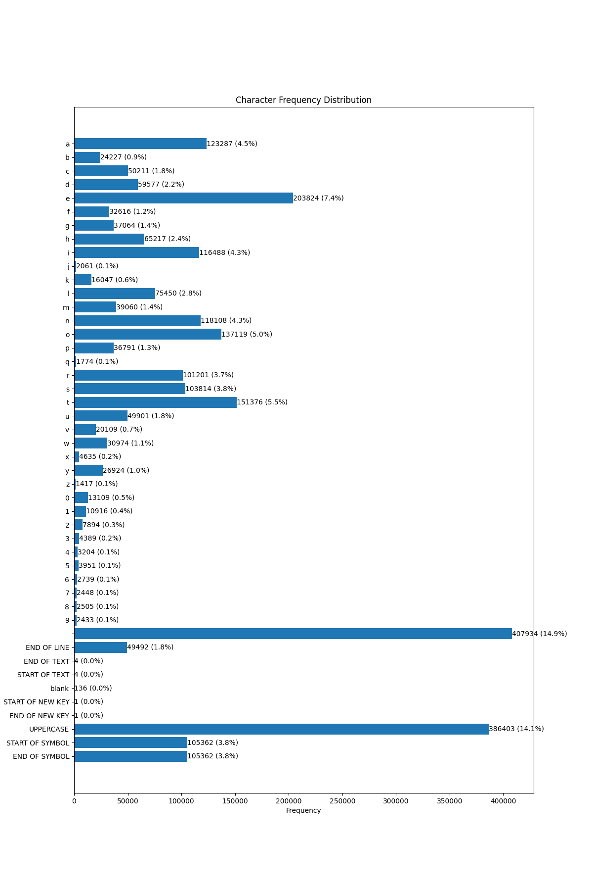

# Method

## Key

- [Method](#method)
  - [Key](#key)
  - [Character Frequency Distribution](#character-frequency-distribution)
    - [Obtaining the Data](#obtaining-the-data)
    - [Processing the Data](#processing-the-data)
    - [Results](#results)
    - [Notes About the Data](#notes-about-the-data)
  - [Color Cipher Algorithms](#color-cipher-algorithms)
    - [Type 1U](#type-1u)
      - [Description Of 1U](#description-of-1u)
      - [1U Formula](#1u-formula)
    - [Example](#example)

## Character Frequency Distribution

### Obtaining the Data

The data was obtained from the [Fitaly](http://www.fitaly.com/board/domper3/posts/136.html) website. The data was copied and pasted into a text file. The text file was then read into a Python script and processed to obtain the character frequency distribution.

### Processing the Data

The data was processed using the following Python script:

```python
from collections import defaultdict

data = """
Characters: 2,376,378
Spaces: 407,934 (17.1662%)
Commas: 17,546 ( 0.7384%)
Periods: 35,940 ( 1.5124%)
Digits: 53,588 ( 2.2550%)
Letter E: 210,175 ( 8.8443%)

Other punct.: 105,362 ( 4.4337%)
Total punct.: 158,848 ( 6.6845%)
Capitals: 126,736 ( 5.3332%)
Lowercase: 1,629,272 (68.5611%)
Carriage Rtn: 49,492 ( 2.0827%)

Detailed stats per character:
ASCII Char Count
9 136 ( 0.0057%)
23 1 ( 0.0000%)
32 407,934 (17.1662%)
33 ! 170 ( 0.0072%)
34 " 5,804 ( 0.2442%)
35 # 425 ( 0.0179%)
36 $ 1,333 ( 0.0561%)
37 % 380 ( 0.0160%)
38 & 536 ( 0.0226%)
39 ' 5,816 ( 0.2447%)
40 ( 5,176 ( 0.2178%)
41 ) 5,307 ( 0.2233%)
42 * 1,493 ( 0.0628%)
43 + 511 ( 0.0215%)
44 , 17,546 ( 0.7384%)
45 - 32,638 ( 1.3734%)
46 . 35,940 ( 1.5124%)
47 / 3,681 ( 0.1549%)
48 0 13,109 ( 0.5516%)
49 1 10,916 ( 0.4594%)
50 2 7,894 ( 0.3322%)
51 3 4,389 ( 0.1847%)
52 4 3,204 ( 0.1348%)
53 5 3,951 ( 0.1663%)
54 6 2,739 ( 0.1153%)
55 7 2,448 ( 0.1030%)
56 8 2,505 ( 0.1054%)
57 9 2,433 ( 0.1024%)
58 : 10,347 ( 0.4354%)
59 ; 2,884 ( 0.1214%)
60 < 2,911 ( 0.1225%)
61 = 540 ( 0.0227%)
62 > 2,952 ( 0.1242%)
63 ? 3,503 ( 0.1474%)
64 @ 173 ( 0.0073%)
65 A 7,444 ( 0.3132%)
66 B 5,140 ( 0.2163%)
67 C 9,283 ( 0.3906%)
68 D 7,489 ( 0.3151%)
69 E 6,351 ( 0.2673%)
70 F 3,365 ( 0.1416%)
71 G 4,459 ( 0.1876%)
72 H 5,515 ( 0.2321%)
73 I 7,631 ( 0.3211%)
74 J 4,102 ( 0.1726%)
75 K 1,633 ( 0.0687%)
76 L 4,476 ( 0.1884%)
77 M 8,386 ( 0.3529%)
78 N 4,954 ( 0.2085%)
79 O 4,378 ( 0.1842%)
80 P 6,211 ( 0.2614%)
81 Q 751 ( 0.0316%)
82 R 5,986 ( 0.2519%)
83 S 9,512 ( 0.4003%)
84 T 7,895 ( 0.3322%)
85 U 1,934 ( 0.0814%)
86 V 2,119 ( 0.0892%)
87 W 6,005 ( 0.2527%)
88 X 815 ( 0.0343%)
89 Y 722 ( 0.0304%)
90 Z 180 ( 0.0076%)
91 [ 205 ( 0.0086%)
92 \ 37 ( 0.0016%)
93 ] 210 ( 0.0088%)
94 ^ 8 ( 0.0003%)
95 _ 2,755 ( 0.1159%)
96 ` 21 ( 0.0009%)
97 a 123,287 ( 5.1880%)
98 b 24,227 ( 1.0195%)
99 c 50,211 ( 2.1129%)
100 d 59,577 ( 2.5071%)
101 e 203,824 ( 8.5771%)
102 f 32,616 ( 1.3725%)
103 g 37,064 ( 1.5597%)
104 h 65,217 ( 2.7444%)
105 i 116,488 ( 4.9019%)
106 j 2,061 ( 0.0867%)
107 k 16,047 ( 0.6753%)
108 l 75,450 ( 3.1750%)
109 m 39,060 ( 1.6437%)
110 n 118,108 ( 4.9701%)
111 o 137,119 ( 5.7701%)
112 p 36,791 ( 1.5482%)
113 q 1,774 ( 0.0747%)
114 r 101,201 ( 4.2586%)
115 s 103,814 ( 4.3686%)
116 t 151,376 ( 6.3700%)
117 u 49,901 ( 2.0999%)
118 v 20,109 ( 0.8462%)
119 w 30,974 ( 1.3034%)
120 x 4,635 ( 0.1950%)
121 y 26,924 ( 1.1330%)
122 z 1,417 ( 0.0596%)
123 { 62 ( 0.0026%)
124 | 16 ( 0.0007%)
125 } 61 ( 0.0026%)
126 ~ 8 ( 0.0003%)
131 ƒ 1 ( 0.0000%)
149 • 15,233 ( 0.6410%)
183 · 23 ( 0.0010%)
223 ß 1 ( 0.0000%)
226 â 1 ( 0.0000%)
229 å 1 ( 0.0000%)
230 æ 1 ( 0.0000%)
237 í 1 ( 0.0000%)
"""

# Parse the data into a dictionary
char_count = defaultdict(int)
upper = 0
total_chars = 0

lines = data.split('\n')
for line in lines:
    if line.strip() == "":
        continue
    parts = line.split()
    if len(parts) < 3:
        continue
    try:
        char = parts[1]
        count = int(parts[2].replace('(', '').replace(')', '').replace(',', ''))
        if 'A' <= char <= 'Z':
            upper += count
        elif char == '32':
            char_count[' '] += count
        else:
            char_count[char] += count
        total_chars += count
    except ValueError:
        continue

# Extract and print frequency of a-z, 0-9, and space
print("Character Frequency:")
for char in 'abcdefghijklmnopqrstuvwxyz0123456789 ':
    print(f"{char}: {char_count.get(char, 0)}")

print(f"Uppercase letters total: {upper}")
```

### Results




The bar graph and pie chart show the character frequency distribution of the text data. The most frequent characters are the lowercase letter 'e' and the space character.

### Notes About the Data

Special characters such as punctuation marks and digits are aggregated into the symbol start and end characters. A full stop is represented by an empty symbol.

## Color Cipher Algorithms

### Type 1U

#### Description Of 1U

The Type 1U color cipher algorithm encodes data into an image by having each color (red, green, blue channels) represent a different character. The algorithm works by mapping each character to a set of colors. The colors are then distributed along a line based on the frequency of the characters. The algorithm ensures that the colors are evenly distributed along the line based on the frequency of the characters. This ensures that the Frequently Occurring Characters (FOCs) have more colors assigned to them, making the

#### 1U Formula
The formula distributes a list of $N$ objects along a line of length $L$ such that each object appears with its specified frequency $N_{\text{subF}}$, and the total number of points along the line equals $L$.

1. **Define the Variables:**
   - $N$: Total number of distinct objects.
   - $N_{\text{subF}}$: A list of frequencies for each object, where $N_{\text{subF}}[i]$ is the frequency of the $i$-th object.
   - $L$: Total length of the line.

2. **Sum of Frequencies:**

   $$\text{SumF} = \sum_{i=1}^{N} N_{\text{subF}}[i]$$

3. **Normalized Length for Each Object:**

   $$L_{\text{subF}}[i] = \left( \frac{N_{\text{subF}}[i]}{\text{SumF}} \right) \times L$$

   This represents the segment of the line $L$ that each object $i$ occupies based on its frequency.

4. **Distribute Points Along the Line:**

    $$\text{interval}_i = \frac{L}{N_{\text{subF}}[i]}$$

    $$\text{position}_i[j] = \left\lfloor j \times \text{interval}_i \right\rfloor \quad \text{for } j \in \{0, 1, \ldots, N_{\text{subF}}[i] - 1\}$$


### Example

For $N = 3$, $N_{\text{subF}} = [2, 3, 5]$ , and $L = 10$, the output will be a list of length $L$ with the objects distributed more evenly according to their frequencies:

$$\text{SumF} = 2 + 3 + 5 = 10$$

$$L_{\text{subF}}[0] = \left( \frac{2}{10} \right) \times 10 = 2$$

$$L_{\text{subF}}[1] = \left( \frac{3}{10} \right) \times 10 = 3$$

$$L_{\text{subF}}[2] = \left( \frac{5}{10} \right) \times 10 = 5$$

The intervals for placing the objects would be calculated as follows:

$$\text{interval}_0 = \frac{10}{2} = 5$$

$$\text{interval}_1 = \frac{10}{3} \approx 3.33$$

$$\text{interval}_2 = \frac{10}{5} = 2$$

This results in the following distribution:

$$\text{position}_0 = [0, 5]$$

$$\text{position}_1 = [0, 3, 6]$$

$$\text{position}_2 = [0, 2, 4, 6, 8]$$

Mapping these positions onto the line, we get:

$$\text{line} = [0, 2, 1, 2, 2, 0, 1, 2, 2, 1]$$

This method ensures that the points are more evenly spread along the line $L$.